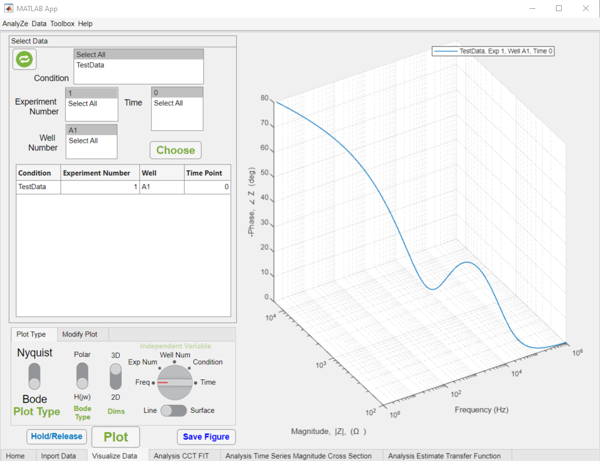
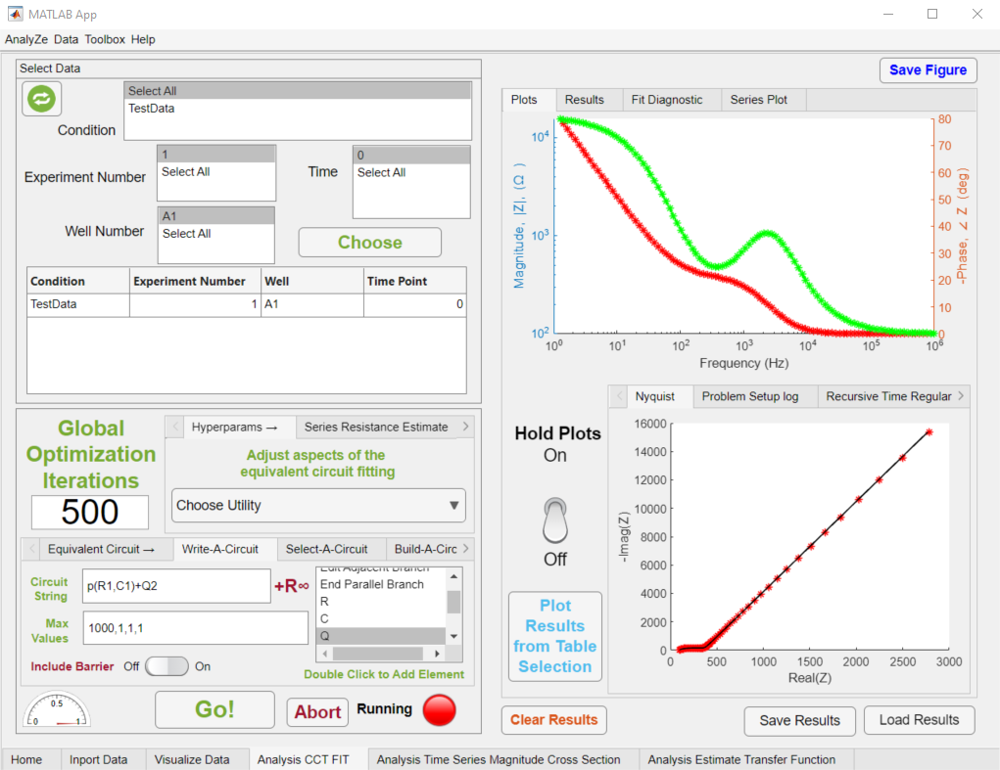
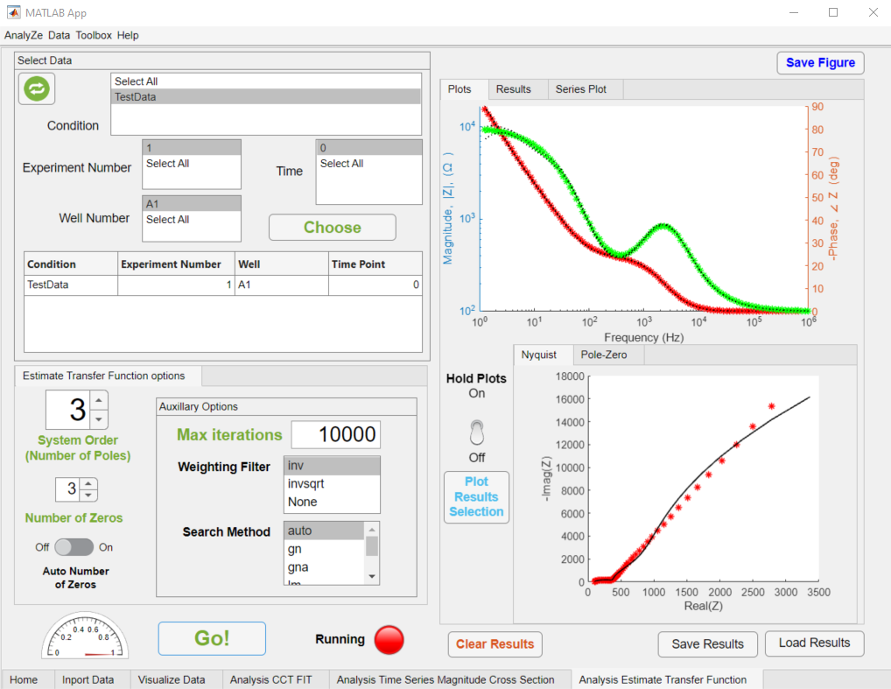

# Introduction
Electrical currents in the biological context are almost exclusively realised as ionic flux and therefore, in order to monitor (and stimulate) biological systems using electronics, electronic flow needs to be coupled ionic flow; this is the province of electrochemistry. Electrodes, inserted into the ionic conducting phase (inhabited by the biology), serve as the interface between ionic flow and electronic flow. However, the voltage-current relationship in electrochemical systems is notoriously non-linear - in particular, the measured current is a non-linear combination of the current (modulations) contributions from each physical process within the electrochemical cell, including the biological system [@bard2022electrochemical]. 

Small-signal linearization is a common technique when treating with non-linear systems, wherein a small (sinusoidal) perturbation is applied to the system. If the perturbation (i.e. the applied voltage in a potentiostatic scenario) is sufficiently small, relative to the non-linearity of the system, then the corresponding output of the system can be approximated as linearly related to the input perturbation. A linear approximation of the system, in the region of an operating (bias) point, can therefore be measured. For a sinusoidal voltage-current, input-output pair, the ratio of the voltage to current yields the impedance of the net system. The impedance is a linear combination of the physical phenomena in the system and can therefore be more easily decomposed into its constituent parts. In the field of electrochemistry, this measurement is known as electrical impedance spectroscopy (EIS) [@wang2021electrochemical] and the process of decomposing the measurement using an appropriate model of the system, is known as system identification. The most common form of system identification involves modelling the linear system as an equivalent circuit, where each circuit element models the voltage-current relationship exhibited by the linear approximation of one of the physical processes participating in the measurement. 

# Statement of Need

Fitting equivalent circuits to impedance data is a common exercise and various software solutions exist to meet this need, including paid (or 'freemium') software, such as `EC-lab` [@BioLogic_2023], `ZView` [@scribnerZViewsupsupWindows], `Nova` [@metrohmNOVA] and `PSTrace` [@palmsensPSTracePalmSens] as well as open-source solutions such as `impedance.py` [@murbach2020impedance] and `ZFit` [@ZFit]. In general, the GUI-based solutions are proprietary and closed-source, while open source solutions are implemented as software packages. There therefore exists an accessibility concern, wherein researchers with a preference for graphical software are limited to the use of inflexible, proprietary solutions, while those with the prerequisite coding skillset, who wish to develop bespoke variations of the impedance post-processing process, are limited to implementing scripted solutions which have a reduced appeal to other researchers in the field. We believe that, in order to democratize the knowledge being developed in the field of impedance data processing and minimize the barrier to adoption of community-driven advancement is the field, a flexible, open-source, GUI based solution is needed. 

`AnalyZe` was initially developed specifically for bioimpedance applications, although the design flexibility is such that it can be retooled or extended for a variety of applications. In order to maximize utility of this first iteration of the software, the most common bioimpedance scenario is targeted, wherein a collection of biological cells mediate the ionic flux; the flow of ions is considered to follow two paths, the paracellular path (flow between cells) which is primarily resistive, and the transcellular path (flow through cells) which is primarily capacitive [@benson2013impedance]. This biological barrier (to current flow) is commonly modelled as a parallel resistance and capacitance. as shown in \autoref{fig:Intro_BarrierImpedance }, the net impedance is, in the most general case, a linear combination of this barrier, the series (electrolyte) resistance of the system, and the impedance contribution of the electrode-electrolyte interfaces. 

![In a generic bioimpedance scenario, ionic flux is induced between two electrodes (conventionally referred to as the counter and working electrodes), such that the flux is impeded by the biological system situated within the applied field. The ionic current flows between the cells, via the paracellular pathway and across the cells, via the transcellular pathway. Ionic flux in the case of the former is impeded by intercellular junctions resistively, while current flow via the transcellular pathway is impeded primarily capacitively due to the low permittivity (and subsequent polarization) of the cell membranes. \label{fig:Intro_BarrierImpedance }](PaperFigures/Intro_BarrierImpedance.png)

# Current Functionality of `AnalyZe`

`AnalyZe` is built using MATLABs App Designer utility and currently allows for EIS data to be imported, visualized and processed by way of either equivalent circuit fitting, single frequency cross-sections over multiple measurement time points or Laplace transfer function estimation. The objective of `AnalyZe` is to build the initial components of toolkit for handling and processing bioimpedance data. Tab groups are ubiquitous in MATLAB applications and so `AnalyZe` is designed around tab hierarchies, where each tool in the toolkit inhabits a tab in the primary tab group, with sub-tab groups taking responsibility for tool functionality which is of a type (such as handling raw data locally, adjusting regression parameters or displaying output). Ideally, this will assist in enforcing separation of concerns and promote decoupling and independence of each new tool in the toolkit, so as to optimize for robustness.      

An additional design decision of note is the software tutorial approach; in order to minimize the barrier to adoption of the application, on-the-fly instructions and explanations are embedded into the application, which are displayed when the user attempts an actions associated with the tutorial information. In the flowing sections, the current state of the toolkit functionality is discussed.

## Data Handling

`AnalyZe` allows for impedance data to be imported and labelled by condition, experiment, well (alias for instance of a technical replicate) and time, which allows for subsets of the data to be easily selected for batched use within the toolkit. Further, data imported into the application can be saved (in .mat format) for use in subsequent sessions. \autoref{fig:Screen_Visualize} depicts the data visualization module as implemented currently, where impedance data can be visualized either in the complex (Nyquist) or polar (Bode) representations and either as standard two-dimensional, overlayed representations, or as three-dimensional renderings as line plots or interpolated surfaces, with control over the z-axis variable (in this instance, frequency). 

A design pattern which is current conserved throughout the application is the use of a top-to-bottom, left-to-right control flow, with each stage of the procedure contained by a UI panel or tab group. Generally, a subset of the imported data is selected, the toolkit settings are adjusted and the selected data is batch processed and displayed. Ideally, each tool is equipped to allow for the data to be exported (both as .mat and as text-based formats) and for the generated images to be saved (both as MATLAB editable .fig files as well as in conventional file types).  

 

## Equivalent Circuit Fitting

Equivalent circuit fitting in `AnalyZe` allows for batch processing of impedance data (using a common equivalent circuit and regression setting) where the circuit can be specified as an arbitrary circuit string, using either hard-coded models for common circuit elements or alternatively by specifying a custom model for a bespoke circuit element. The complex, non-linear, least-squares regression is implemented with the following objective function [@boukamp1986nonlinear]:

$$ \hat{\mathbf{x}} = \arg\min_{\mathbf{x}} \sum_{\omega}w(\omega)\cdot \biggl(Re(Z_{measured}(\omega))) - Re(Z_{circuit}(\mathbf{x},\omega))\biggr)^2 $$
		$$ + \sum_{\omega}w(\omega)\cdot \biggl(Im(Z_{measured}(\omega))) - Im(Z_{circuit}(\mathbf{x},\omega))\biggr)^2 $$
where
$$w(\omega) = \frac{1}{Re(Z_{measured}(\omega))^2 + Im(Z_{measured}(\omega))^2} = (Z_{measured} \cdot \overline{Z_{measured}})^{-1}$$

Where, $\hat{\mathbf{x}}$ is the set of estimated circuit parameters, $Z_{measured}$ is the measured, complex valued, impedance data, $Z_{circuit}$ is the impedance of the circuit model evaluated at a particular angular frequency, $\omega$ and parameter set, $\mathbf{x}$. A trivial use case of the circuit fitting utility is shown in \autoref{fig:Screen_CCT_Fit}. 

Equivalent circuit fitting can be a challenging exercise, in particular due to the ill-posedness of the problem. This manifests as both a high sensitivity of the regression fit to the optimization routine initial conditions (referred to as an initial guess elsewhere) as well as to the chosen circuit model itself; where many models are ambiguous in that they fit the data equally well. In order to improve the robustness of the fit and decouple the results from user input as much as possible, MATLABs Global Optimization Toolbox is used in conjunction with MATLABs constrained optimization routine [@mathworksGlobalOptimization; @mathworksOptimizationToolbox]. In particular, the MultiStart algorithm interrogates a defined initial condition space for the optimal fit. In order to assist the user in tailoring the model to be maximally parsimonious, the results are accompanied by conventional fitness metrics as well as information criterion. Further, the complex residuals and Q-Q plots are generated, to better assess the estimated noise distribution and appropriateness of the model. 

As stated above, the emphasis of the current realization of `AnalyZe` is on the analysis of the impedance of biological systems, characterised by a parallel resistance and capacitance, in its simplest form. Thus, while the equivalent circuit module allows for arbitrary circuit fitting, as well as post-processing and plotting of any fitted model parameter, special consideration is afforded to the biological barrier resistance and capacitance in order to expedite examination of these parameters.
Finally, a common use case is for the impedance of a biological system to be measured over time - the extracted equivalent circuit parameters can therefore be plotted within the application as a function of time to yield the temporal dynamics of the system.  

## Transfer Function System Identification

The term transfer function is used generally to refer to the mapping from a system input to the resulting output. It is more commonly used to refer specifically to the mapping between the Fourier transform of the input to that of the output and is defined in the complex frequency domain, $s = \sigma + j\omega$. By definition, for a sinusoidal input at a particular frequency, the resulting sinusoidal output is scaled in magnitude and phase shifted by the magnitude and phase of the (Laplace) transfer function, evaluated at the frequency in question [@lathi2005linear]. The measured impedance is therefore equal to the transfer function, evaluated at the real frequencies measured [@lazanas2023electrochemical]. 

$$ Z(\omega) = H(s)\biggr\rvert_{s=j\omega}$$

and is given in standard form as

$$ H(s) = \frac{(s-z_0)(s-z_1)\dots(s-z_m)}{(s-p_0)(s-p_1)\dots(s-p_n)} $$

The poles of the transfer function, $\{p_0,p_1,\dots ,p_n\}$ are inversely related to the time constants of the system, which, for the tissue barrier modelled as a parallel resistance and capacitance, is equal to $\tau = RC$. While the time constant associated with the biological component of the system is necessarily a coarser measure than the circuit parameters (as it is a mixture of the two circuit parameters), the *a priori* information required is minimized and consists only of the system order. The transfer function estimation is therefore highly conservative, relative to the ill-posed and circuit-model-dependent circuit fitting.

`AnalyZe` currently includes a module in the toolkit for estimating the transfer function from the measured impedance data using MATLABs system identification functionality (see \autoref{fig:Screen_TF_Fit}). 

Using a similar workflow to the equivalent circuit fitting module, the poles of the system can be plotted in time (as estimated from a sequence of impedance spectra) and each fit is accompanied by goodness of fit measures, confidence intervals and information criteria metrics. 

## References
